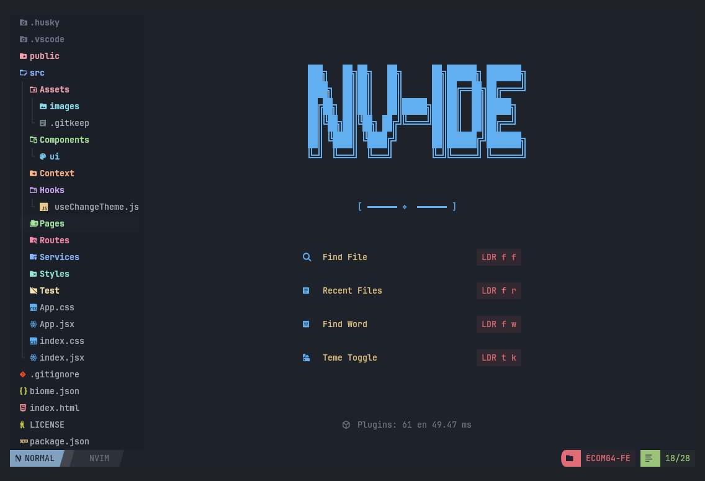
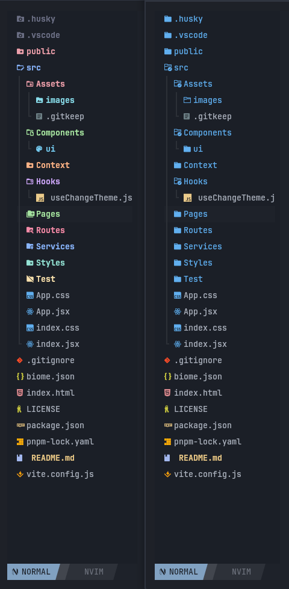

# nvim-tree-material-folders

Semantic folder icons and colors for **nvim-tree**, inspired by VSCode
icon themes and designed for clean, professional project trees.



---

## ✨ Features

- 📂 **Semantic folder families**
  - core, frontend, backend, state, database, assets, tests, docs, tools, etc.
- 🧩 **Subfamilies**
  - `components/forms`, `assets/images`, `src/hooks`, `src/types`, …
- 🧠 **Smart resolution pipeline**
  - subfamily → path → name
- 🎨 **Material-style colors**
  - consistent, readable, non-distracting
- ⚡ **Lazy & efficient**
  - patch applied only when nvim-tree is open
- 🧼 **Clean architecture**
  - resolver, cache, patch, highlights separated

---

## 🔍 Why?

nvim-tree by default treats all folders the same.

This plugin adds **meaning**.

Just like VSCode icon themes, folders communicate their role instantly:
frontend, backend, assets, config, tests — without reading names.



---

## 📦 Requirements

- Neovim ≥ 0.9
- [nvim-tree.lua](https://github.com/nvim-tree/nvim-tree.lua)
- Nerd Font enabled

---

## 📥 Installation

### lazy.nvim

```lua
{
  "rosasrias/nvim-tree-material-folders",
  dependencies = { "nvim-tree/nvim-tree.lua" },
} 
```

## 🚀 Quick Start (recommended)

```lua
require("nvim_tree_material_folders").setup()
```

Enable the patch lazily when nvim-tree attaches:
```lua
require("nvim-tree").setup({
  on_attach = function()
    require("nvim_tree_material_folders").apply()
  end,
})
```
- ✔ No startup overhead
- ✔ Patch applied once
- ✔ Cache cleared when nvim-tree closes

## 🧠 Resolution Pipeline 

Folder semantics are resolved in this order:

### 1️⃣ Subfamily (highest priority)

Matches specific paths:
```bash
assets/images        → images
components/forms     → forms
src/hooks            → hooks
```

Each subfamily defines:
- icon
- color
- inherited family

### 2️⃣ Path-based family

Matches semantic paths:
```bash
src/api/**           → backend
src/components/**    → frontend
src/db/**            → database
```
This allows the same folder name to mean different things
depending on location.

### 3️⃣ Name-based family (fallback)

Matches by folder name only:
```bash
components/          → frontend
services/            → backend
docs/                → docs
```

## 🎨 Folder Families 
Families represent roles, not technologies:

- core
- frontend
- backend
- state
- database
- styles
- assets
- tests
- docs
- tools
- config
- build

You can extend or override them freely.


## 🧩 Subfamilies 
Subfamilies refine a family with more precise semantics:

Examples included:
- `assets/images`
- `assets/icons`
- `components/forms`
- `components/ui`
- `src/hooks`
- `src/types`
- `src/utils`

Each subfamily can override:
- `icon`
- `color`

## ⚙️ Customization

Everything is optional.

Override only what you need:
```lua
require("nvim_tree_material_folders").setup({
  overrides = {
    icons = {
      frontend = {
        default = "󰉋",
        open = "󰉋",
      },
    },
  },
})
```

## ⚡ Performance 

- Results cached per node
- Cache cleared on NvimTreeClose
- No work done if nvim-tree is not open
- No filesystem scanning
- O(1) lookup after first resolve

Designed to be safe even on large monorepos.

## 🧪 Debugging

If a folder does not look right:

1. Check subfamily match
2. Check path-based match
3. Check name-based match

(Debug command planned)

## 🧩 Supported Architectures

Works great with:

- Frontend apps
- Backend services
- Monorepos
- Clean / Hexagonal Architecture
- Mobile (Android / iOS)
- Desktop (Electron / Tauri)
- Framework-specific subfamilies coming next 👀

## 📜 License

MIT © rosasrias
